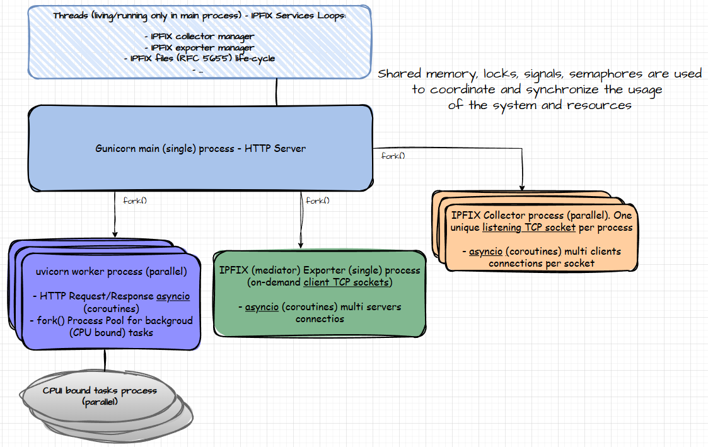

# IPyFIXweb

**Enterprise-grade IPFIX and PCAP traffic analysis and processing system.**

## Overview

IPyFIXweb is a high-performance, production-ready system for network traffic analysis, featuring PCAP to IPFIX conversion with Deep Packet Inspection (thanks to [**YAF**](https://tools.netsa.cert.org/yaf/index.html)), IPFIX capabilities: analysis, collector, mediator and exporter (thanks to [**pyfixbuf library**](https://tools.netsa.cert.org/pyfixbuf/doc/index.html)), and also analysis with time-series data and PCAP decoding (thanks to [**scapy**](https://scapy.net/)).

## Architecture

### Hexagonal Architecture


### Process, Thread and Concurrence Model



## Architecture Components

| Component | Purpose | Location | Key Features |
|-----------|---------|----------|--------------|
| Task Manager | shared memory coordination | `src/core/use_cases/file_exporter/task_manager.py` | Slot management, cleanup |
| Worker Handler | Process pool task execution | `src/core/use_cases/file_exporter/worker_handler.py` | Critical shared memory validation, comprehensive exception handling |
| Export Orchestrator | Main task lifecycle management | `src/core/use_cases/file_exporter/export_task.py` | Semaphore-controlled access, timeout-based rejection |
| System Management | Process pools and shared resources | `src/core/use_cases/file_exporter/subsys_mgmt.py` | Semaphore singletons, self-healing executors, shared memory manager, selective process cleanup |
| Web Server | FastAPI application with signal handling | `src/adapters/web_api/fastapi/web_server.py` | Container-optimized shutdown, SIGTERM/SIGINT handlers |
| Shutdown Handler | Graceful cleanup orchestration | `src/cmds/shutdown.py` | Pure Python shutdown, container-friendly exit |

## AI Agent Draft Plans

The [Lua language](https://www.lua.org/) will be the way where the AI agent will execute and interact directly with the system. This project will integrate the Lua language in Cpython (standard Python implementation) with a [LuaJIT](https://luajit.org/) (just-in-time compiler). Thanks to [Lupa project](https://github.com/scoder/lupa) for this Python integration.


* The IPFIX collector and exporter settings will be defined in Lua (a Lua conf style file), allowing the AI agent to dynamically create and modify IPFIX exporters and collectors definitions based on real-time analysis and requirements.
> The Lua integration will start here: settings defined in Lua (also outside the AI agent scope).

* The IPFIX mediator pipelines will be defined and executed in Lua, enabling the AI agent to create new analysis / transformations pipelines and exporter definitions on-the-fly, adapting to network conditions and traffic patterns.

* Integrate the tasks and analysis (form RESTful API), enabling the AI agent to adjust analysis pipelines and tasks dynamically based on the data (passed from users and obtained from analyses in execution).

> This part of system will bring a lot of engineering and development work. Should be good the [C fixbuf library](https://tools.netsa.cert.org/fixbuf/index.html) is implemented/integrated in Lua, so the agent will be able to use it directly. The [RRDLua](https://oss.oetiker.ch/rrdtool/prog/rrdlua.en.html) binding already exists, so the agent will be able to use it for time-series data analysis.

## dev_roadmap
- [ ] Complete PCAP to IPFIX (with DPI) conversion task.
- [ ] IPFIX analysis: Paginated response with each record and information-elements (including DPI) decoded as JSON.
  - [ ] Starting testing with [IPjFIXsvc](https://github.com/mesbrj/IPjFIXsvc).
- [ ] IPFIX collector and Lua integration - Lua configuration file for IPFIX collector(s). Lua starts the Python IPFIX collector(s) according to the IPFIX collector configuration.

## Quick Start

### Prerequisites
- Python 3.13+
- Linux environment (WSL not recommended, issues with container image builds)

### Installation
```bash
pip install -r requirements.txt
```

### Basic Usage
```bash
# Start development server
python src/cmds/main.py
```

### API Endpoints
```bash
# Submit PCAP export task (test example)
curl -X POST http://172.16.0.102:8000/api/v1/test/file_exporter/export_task

POST /api/export-task
{
  "pcap_files": ["/path/to/file.pcap"],
  "output_path": "/path/to/output.ipfix",
  "DPI": true,
  "analysis_list": ["tcp", "udp"]
}

# Get task status
GET /api/task-status/{task_id}

# List active tasks
GET /api/tasks
```
## Testing & Volume Tests

### Basic Functionality Test
```bash
# Start the server
python src/cmds/main.py

# Submit single task
curl -X POST http://localhost:8000/api/v1/test/file_exporter/export_task
```

### Simultaneous Load Testing
```bash
# Test semaphore-based flow control with simultaneous submissions
# This tests the new prevention-based architecture

# High-volume concurrent test (10 simultaneous tasks)
for i in {1..10}; do
  curl -X POST http://localhost:8000/api/v1/test/file_exporter/export_task &
done
wait

# Extended volume test (50 tasks in batches)
for batch in {1..5}; do
  echo "Starting batch $batch..."
  for i in {1..10}; do
    curl -X POST http://localhost:8000/api/v1/test/file_exporter/export_task &
  done
  wait
  echo "Batch $batch completed, waiting 2s..."
  sleep 2
done

# Stress test - rapid fire submissions (tests semaphore limits)
for i in {1..25}; do
  curl -X POST http://localhost:8000/api/v1/test/file_exporter/export_task &
  if [ $((i % 5)) -eq 0 ]; then
    echo "Submitted $i tasks..."
    sleep 1
  fi
done
wait
```

### Container Testing
```bash
# Build and test container deployment
podman build -t ipyfixweb-test .
podman run --name ipyfixweb-test -p 8000:8000 -d ipyfixweb-test

# Test container stability under load
for i in {1..20}; do
  curl -X POST http://localhost:8000/api/v1/test/file_exporter/export_task &
done
wait

# Test graceful shutdown (should complete in ~30s)
time podman stop ipyfixweb-test

# Check logs for clean shutdown
podman logs ipyfixweb-test | grep -E "(shutdown|cleanup|killed.*processes)"
```

### Process Pool Resilience Test
```bash
# Test process pool self-healing capabilities
# Submit tasks to trigger potential BrokenProcessPool scenarios

# Rapid concurrent submissions to stress process pool
seq 1 30 | xargs -n1 -P10 -I{} curl -X POST http://localhost:8000/api/v1/test/file_exporter/export_task

# Monitor logs for process pool recreation events
tail -f /var/log/IPyFIXweb/*.log | grep -E "(recreat|broken|semaphore|killed.*process)"
```

### Performance Benchmarks
```bash
# Measure baseline performance
time seq 1 20 | xargs -n1 -P5 -I{} curl -s -X POST http://localhost:8000/api/v1/test/file_exporter/export_task

# Expected results:
# - No server freezing under high load
# - Consistent response times even when pool is saturated
# - Graceful task rejection instead of timeouts
```
