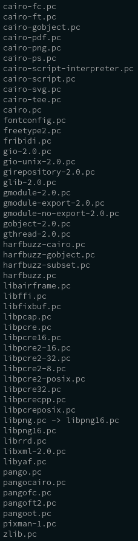

# C lib builds

Mantain the dependencies, compilation and linking of the C libs used in the project/app.

Dependences with container base image (python slim):
>* Base image Linux c runtime/implementation: ld, libc/libm(so/math), vDSO, ...
>* openssl/crypto lib (of the base image).
>> Because of it, libs like zlib are builded in this process.

[The Dockerfile](../../../Dockerfile) is used to build and install the *tarballs* (source codes of libraries). The [pkg-config](https://people.freedesktop.org/~dbn/pkg-config-guide.html) is used to help correct compile and link the all libraries builded from source. The prefix install of all builds is: **/opt/**

**Current C libs builded**
*/opt/lib/pkgconfig/* - Metadata:

*References:*
* https://oss.oetiker.ch/rrdtool/doc/rrdbuild.en.html
* https://tools.netsa.cert.org/fixbuf/libfixbuf/installation.html
* https://tools.netsa.cert.org/pyfixbuf/doc/index.html
* https://tools.netsa.cert.org/yaf/install.html