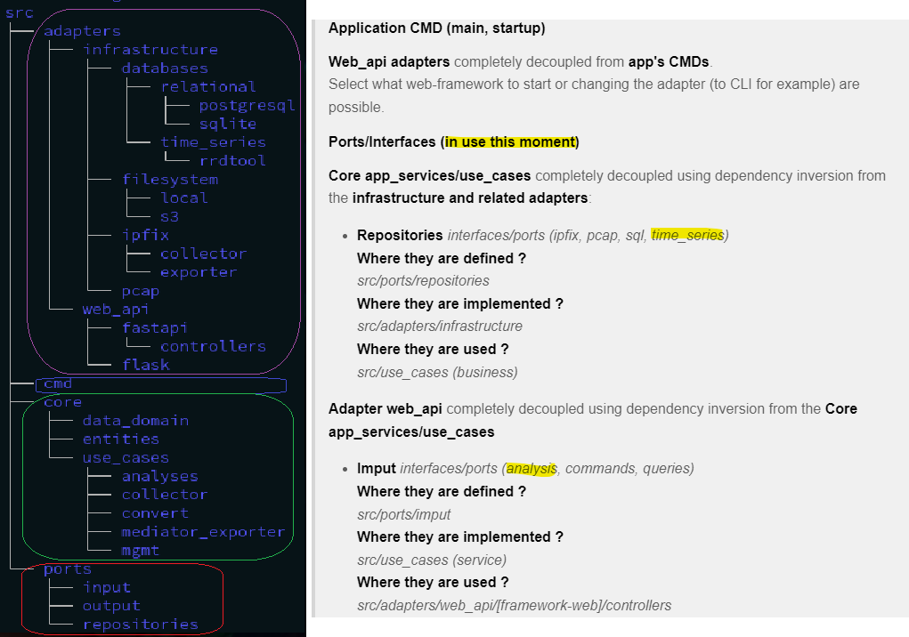

# Development info and details

## Hexagonal Architecture

>**Diagram**

>**Repo directory tree**

---
**More info:**

* [*Some details on: RRDtool (time-series file system adapter)*](./rrdtool_file_system_adapter.md)

* [*Project/App c libs build*](../c_builds/README.md)